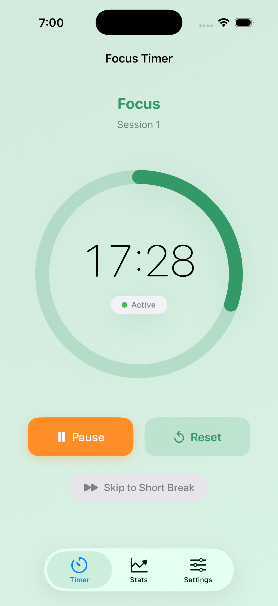
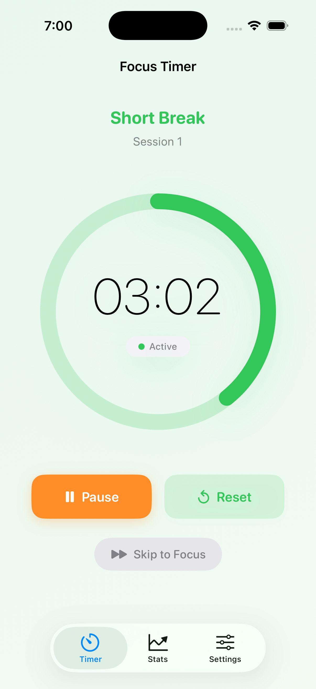
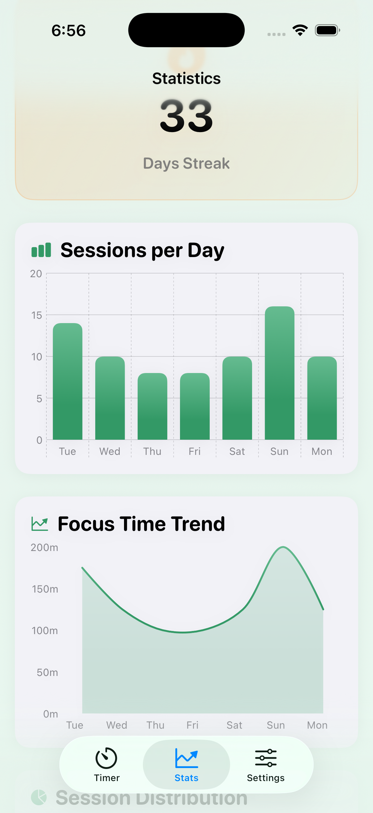

# 🍅 Mr. Pomodoro

> **Focus with ease. Flow with purpose.**

A beautiful, privacy-first Pomodoro timer for iOS and Android. Stay focused, track your productivity, and build better work habits—all while keeping your data completely private.

[](https://www.apple.com/ios/)
[](https://www.android.com/)
[](LICENSE)
[](https://swift.org/)
[](https://kotlinlang.org/)

---

## Features

- **Customizable Timer** - Adjust focus and break durations (1-120 minutes)
- **Smart Statistics** - Track productivity with daily, weekly, and monthly insights
- **5 Beautiful Themes** - Choose from Classic Red, Ocean Blue, Forest Green, Midnight Dark, and Sunset Orange
- **Focus Mode Integration** - Native Do Not Disturb support to minimize distractions
- **Smart Notifications** - Stay on track with timely, non-intrusive alerts
- **Siri Shortcuts (iOS)** - Control your timer with voice commands
- **App Shortcuts (Android)** - Quick actions from your home screen
- **Privacy First** - All data stays on your device, always

---

## Screenshots

<table>
  <tr>
    <td></td>
    <td></td>
    <td></td>
  </tr>
  <tr>
    <td align="center"><em>Focus Mode</em></td>
    <td align="center"><em>Break Time</em></td>
    <td align="center"><em>Your Progress</em></td>
  </tr>
</table>

---

## Download

### iOS
**Requirements:** iOS 18.6 or later

Coming soon to the App Store

### Android
**Requirements:** Android 14.0 (API 34) or later

Coming soon to Google Play

---

## What is the Pomodoro Technique?

The Pomodoro Technique is a proven time management method that breaks work into focused intervals (traditionally 25 minutes) separated by short breaks.

**How it works:**
1. Choose a task to focus on
2. Start a 25-minute focus session
3. Work without distractions until the timer ends
4. Take a 5-minute break
5. After 4 focus sessions, take a longer 15-minute break
6. Repeat and build momentum

This simple approach helps improve focus, reduce mental fatigue, increase productivity, and build sustainable work habits.

---

## Project Structure

```
Mr. Pomodoro/
├── iOS/                    # iOS App (SwiftUI)
├── android/                # Android App (Jetpack Compose)
├── website/                # Marketing Website
├── screenshots/            # App Store Screenshots
├── docs/                   # Technical Documentation
└── PrivacyPolicy.md        # Privacy Policy
```

---

## Tech Stack

### iOS
- **Language:** Swift 5.0+
- **Framework:** SwiftUI
- **Architecture:** MVVM
- **Min Version:** iOS 18.6

### Android
- **Language:** Kotlin 1.9+
- **Framework:** Jetpack Compose
- **Architecture:** MVVM + Clean Architecture
- **Min Version:** Android 14.0 (API 34)

---

## Quick Start

### iOS Development

```bash
# Clone and navigate to iOS directory
git clone https://github.com/avtansh-code/pomodoro_timer.git
cd pomodoro_timer/iOS

# Open in Xcode
open PomodoroTimer.xcodeproj

# Build and run (⌘+R)
```

See **[iOS/README.md](iOS/README.md)** for detailed setup instructions.

### Android Development

```bash
# Clone and navigate to Android directory
git clone https://github.com/avtansh-code/pomodoro_timer.git
cd pomodoro_timer/android

# Build the project
./gradlew build

# Install on device
./gradlew installDebug
```

See **[android/README.md](android/README.md)** for detailed setup instructions.

---

## Documentation

### For Users
- **[Privacy Policy](PrivacyPolicy.md)** - How we protect your privacy
- **[iOS User Guide](iOS/docs/USER_GUIDE.md)** - Complete iOS app guide

### For Developers
- **[Architecture](docs/ARCHITECTURE.md)** - Technical architecture overview
- **[iOS Setup](iOS/README.md)** - iOS development guide
- **[Android Setup](android/README.md)** - Android development guide
- **[Contributing](CONTRIBUTING.md)** - How to contribute
- **[Code of Conduct](CODE_OF_CONDUCT.md)** - Community guidelines
- **[Security](SECURITY.md)** - Security policy

### For Designers
- **[Design System](iOS/docs/DESIGN_SYSTEM.md)** - UI/UX guidelines and specifications

---

## Contributing

We welcome contributions! To get started:

1. Fork the repository
2. Create a feature branch (`git checkout -b feature/amazing-feature`)
3. Commit your changes (`git commit -m 'Add amazing feature'`)
4. Push to the branch (`git push origin feature/amazing-feature`)
5. Open a Pull Request

Please read our [Contributing Guide](CONTRIBUTING.md) for details on our development process, coding standards, and testing requirements.

---

## Privacy & Security

**Your privacy is our priority.** Mr. Pomodoro is designed with privacy at its core:

- **No data collection** - We don't collect any personal information
- **No analytics** - No tracking or usage statistics
- **No third-party services** - No external connections
- **Local storage only** - All data stays on your device
- **Open and transparent** - Review our code and practices

Read our complete [Privacy Policy](PrivacyPolicy.md) or see [SECURITY.md](SECURITY.md) for security information.

---

## License

This project is proprietary software. See [LICENSE](LICENSE) for details.

The code is available for review and learning purposes, but commercial use, redistribution, or derivative works require explicit permission.

---

## Support

- **Bug Reports:** [GitHub Issues](https://github.com/avtansh-code/pomodoro_timer/issues)
- **Feature Requests:** [GitHub Discussions](https://github.com/avtansh-code/pomodoro_timer/discussions)
- **Email:** support@pomodorotimer.in

---

## Developer

Created by **[Avtansh Gupta](https://github.com/avtansh-code)**

- Website: [pomodorotimer.in](https://pomodorotimer.in)
- GitHub: [@avtansh-code](https://github.com/avtansh-code)

---

<div align="center">

**Made with ❤️ using SwiftUI & Jetpack Compose**

</div>
