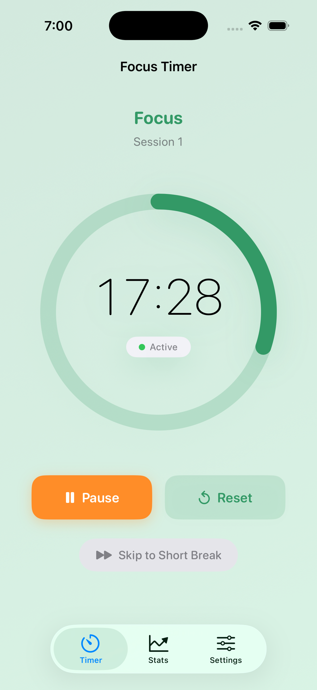

# Mr. Pomodoro - iOS

Native iOS implementation of the Mr. Pomodoro timer app built with SwiftUI for modern iOS devices.

[](https://www.apple.com/ios/)
[](https://swift.org/)
[](https://developer.apple.com/xcode/swiftui/)

---

## Features

- **Full Pomodoro Timer** - Start, pause, resume, and reset functionality
- **Session Management** - Focus, short break, and long break sessions with auto-transition
- **Statistics Tracking** - View productivity metrics with daily, weekly, and all-time views
- **5 Themes** - Classic Red, Ocean Blue, Forest Green, Midnight Dark, Sunset Orange
- **Focus Mode Integration** - Native iOS Focus Mode suggestions during work sessions
- **Siri Shortcuts** - Voice control for timer operations
- **Notifications** - Local notifications for session completion
- **Background Support** - Timer continues running when app is backgrounded
- **Privacy First** - All data stored locally with UserDefaults and CoreData

---

## Screenshots

<table>
  <tr>
    <td></td>
    <td></td>
    <td></td>
  </tr>
  <tr>
    <td align="center"><em>Focus Mode</em></td>
    <td align="center"><em>Break Time</em></td>
    <td align="center"><em>Your Progress</em></td>
  </tr>
</table>

---

## Prerequisites

- **Xcode**: 26.0.1 or later
- **iOS**: 17.0+ (Minimum deployment target)
- **Swift**: 5.0+
- **macOS**: Latest version for Xcode support

---

## Quick Start

### Clone and Build

```bash
# Clone the repository
git clone https://github.com/avtansh-code/pomodoro_timer.git
cd pomodoro_timer/iOS

# Open in Xcode
open PomodoroTimer.xcodeproj

# Build and run (⌘+R)
```

### Running on Device

1. Connect your iPhone or iPad
2. Select your device in Xcode
3. Configure signing in project settings
4. Build and run (⌘+R)
5. Grant notification permissions when prompted

---

## Architecture

The app follows the **MVVM (Model-View-ViewModel)** pattern:

```
iOS/PomodoroTimer/
├── Models/              # Data models
│   ├── TimerSession.swift
│   ├── TimerSettings.swift
│   └── AppTheme.swift
│
├── Services/            # Business logic
│   ├── TimerManager.swift
│   ├── PersistenceManager.swift
│   ├── ThemeManager.swift
│   ├── FocusModeManager.swift
│   ├── HapticManager.swift
│   └── ScreenshotHelper.swift
│
├── Views/               # SwiftUI views
│   ├── MainTimerView.swift
│   ├── SettingsView.swift
│   ├── StatisticsView.swift
│   ├── ThemeSelectionView.swift
│   ├── PomodoroBenefitsView.swift
│   └── PrivacyPolicyView.swift
│
├── AppIntents/          # Siri integration
│   ├── StartPomodoroIntent.swift
│   ├── PauseTimerIntent.swift
│   ├── ResumeTimerIntent.swift
│   ├── ResetTimerIntent.swift
│   └── ShowStatisticsIntent.swift
│
└── Assets.xcassets/     # Images and colors
```

### Key Technologies

- **Language**: Swift 5.0+ with modern concurrency
- **UI**: SwiftUI for declarative interface
- **Architecture**: MVVM pattern
- **Storage**: UserDefaults for settings, CoreData for sessions
- **Reactive**: Combine framework for state management
- **Background**: Timer continues via background execution

---

## Siri Shortcuts

The app supports the following Siri commands:

1. **"Start a Pomodoro Timer"** - Begin a new focus session
2. **"Pause Pomodoro Timer"** - Pause the current timer
3. **"Resume Pomodoro Timer"** - Resume a paused timer
4. **"Reset Pomodoro Timer"** - Reset to beginning
5. **"Show my Pomodoro Timer stats"** - Open statistics

### Setting Up Shortcuts

1. Open Settings > Siri & Search
2. Find "Mr. Pomodoro"
3. Add shortcuts for quick voice access
4. Use your chosen phrase to trigger actions

---

## Focus Mode Integration

The app integrates with iOS Focus Mode:

- **Automatic Suggestions** - App suggests enabling Focus Mode when starting work sessions
- **User Control** - Enable/disable in Settings
- **Privacy First** - App never automatically enables Focus Mode
- **Seamless Integration** - Works with your existing Focus configurations

### Requirements

- iOS 16.1+ for bidirectional sync
- Focus Mode configured in iOS Settings
- Focus Mode integration enabled in app Settings

---

## Configuration

### Build Settings

Key configurations in Xcode project:

```
IPHONEOS_DEPLOYMENT_TARGET = 17.0
SDKROOT = iphoneos
TARGETED_DEVICE_FAMILY = 1,2 (iPhone and iPad)
MARKETING_VERSION = 1.1.0
CURRENT_PROJECT_VERSION = 3
SWIFT_VERSION = 5.0
```

### Capabilities

Required capabilities configured in project:

- Background Modes (for timer)
- Push Notifications (local notifications)
- Siri (for shortcuts)

---

## Development Guidelines

### Code Style

- Follow [Swift API Design Guidelines](https://swift.org/documentation/api-design-guidelines/)
- Use SwiftUI best practices
- Maintain MVVM pattern separation
- Write clear, self-documenting code

### Commit Guidelines

- Write descriptive commit messages
- Keep commits focused and atomic
- Reference issues when applicable

---

## Testing

### Running Tests

```bash
# Run all tests in Xcode
⌘ + U

# Or via command line
xcodebuild test -scheme PomodoroTimer -destination 'platform=iOS Simulator,name=iPhone 15'
```

### Test Coverage

- Business logic covered by unit tests
- UI components tested for accessibility
- Integration tests for key user flows

---

## Building for Release

### TestFlight

1. Archive the project (Product > Archive)
2. Distribute to App Store Connect
3. Upload to TestFlight
4. Invite beta testers

### App Store

1. Complete App Store Connect information
2. Upload build via Xcode
3. Submit for review
4. Monitor review status

See **[App Store Submission Guide](docs/APP_STORE_SUBMISSION.md)** for detailed instructions.

---

## Documentation

### For Users

- **[User Guide](docs/USER_GUIDE.md)** - Complete user documentation

### For Developers

- **[Developer Guide](docs/DEVELOPER_GUIDE.md)** - Technical reference and setup
- **[Design System](docs/DESIGN_SYSTEM.md)** - UI/UX guidelines

### For App Store

- **[App Store Submission](docs/APP_STORE_SUBMISSION.md)** - Submission checklist and requirements
- **[Screenshot Preparation](docs/SCREENSHOT_PREPARATION.md)** - Screenshot generation guide

---

## Android Feature Parity

This iOS app maintains feature parity with the Android version:

| Feature | iOS | Android | Status |
|---------|-----|---------|--------|
| Timer Functionality | ✅ | ✅ | Complete |
| Statistics | ✅ | ✅ | Complete |
| Themes | ✅ | ✅ | Complete |
| Persistence | ✅ | ✅ | Complete |
| Background Operation | ✅ | ✅ | Complete |
| Notifications | ✅ | ✅ | Complete |
| Shortcuts | ✅ (Siri) | ✅ (Launcher) | Complete |

---

## Troubleshooting

### Build Issues

**Problem**: Code signing error
- **Solution**: Configure your development team in Xcode project settings

**Problem**: Missing dependencies
- **Solution**: Clean build folder (⌘ + Shift + K) and rebuild

### Runtime Issues

**Problem**: Notifications not appearing
- **Solution**: Check notification permissions in iOS Settings > Mr. Pomodoro

**Problem**: Siri shortcuts not working
- **Solution**: Ensure Siri permission is granted in Settings

**Problem**: Focus Mode integration not working
- **Solution**: Verify iOS version is 16.1+ and permission is granted

---

## Privacy & Security

- **Local-only storage** - No cloud sync, no data transmission
- **No analytics** - No tracking or usage monitoring
- **No third-party SDKs** - Minimal external dependencies
- **Secure storage** - Uses iOS Keychain for sensitive data

See **[Privacy Policy](../PrivacyPolicy.md)** for complete details.

---

## Related Documentation

- **[Main README](../README.md)** - Project overview
- **[Architecture](../docs/ARCHITECTURE.md)** - Technical architecture
- **[Android Setup](../android/README.md)** - Android development guide
- **[Contributing](../CONTRIBUTING.md)** - Contribution guidelines

---

## License

See [LICENSE](../LICENSE) for details.

---

## Support

- **Issues**: [GitHub Issues](https://github.com/avtansh-code/pomodoro_timer/issues)
- **Email**: support@pomodorotimer.in

---

**Version**: 1.1.2 (Build 6)  
**Min iOS**: 17.0  
**Built with**: Xcode 26.0.1 / Swift 5.0+ / SwiftUI
