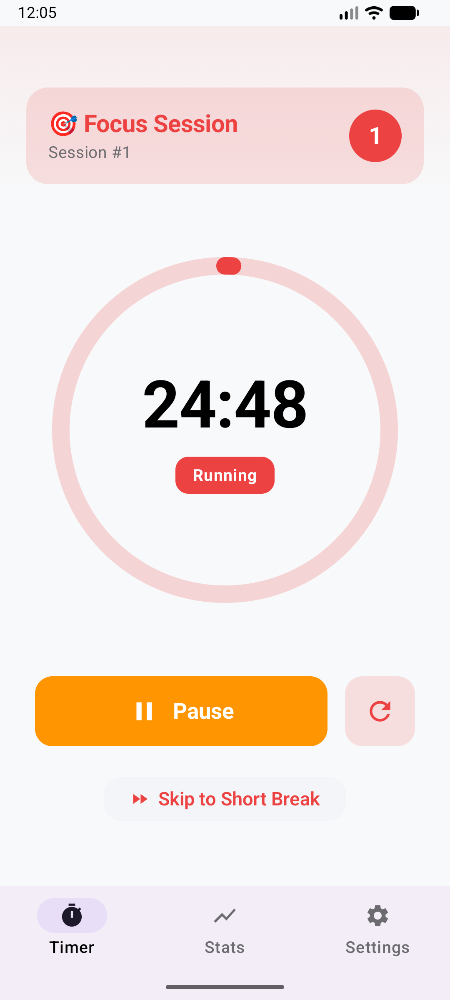
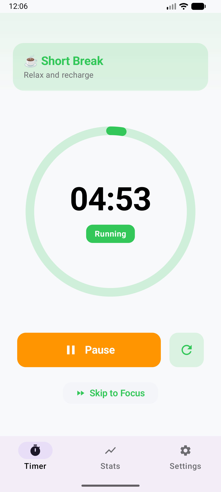
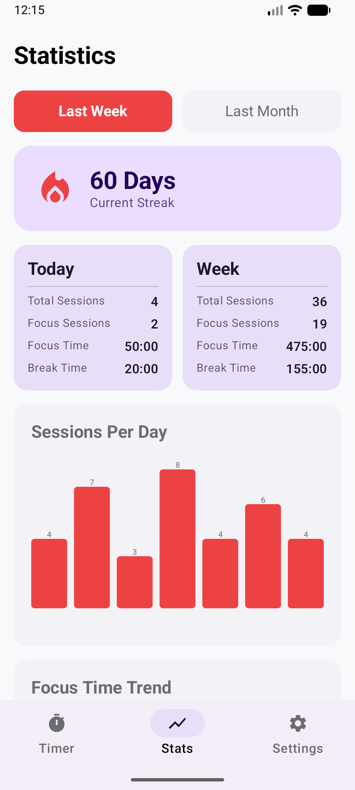

# Mr. Pomodoro - Android (Legacy)

> ⚠️ **RETIRED**: This native Android implementation has been retired. Please use the [Flutter app](../../flutter/pomodoro_timer/README.md) instead, which provides the same features with cross-platform support.

Native Android implementation of the Mr. Pomodoro timer app built with Jetpack Compose and modern Android development practices.

[](https://www.android.com/)
[](https://kotlinlang.org/)
[](https://developer.android.com/jetpack/compose)
[]()

---

## ⚠️ Deprecation Notice

**This native Android app is no longer actively maintained.** 

The project has transitioned to a **Flutter-based cross-platform implementation** which provides:
- Single codebase for iOS and Android
- Consistent UI/UX across platforms
- Easier maintenance and updates
- 200+ comprehensive tests

**➡️ Please use the [Flutter app](../../flutter/pomodoro_timer/README.md) for all new development and contributions.**

---

## Features (Historical Reference)

- **Full Pomodoro Timer** - Complete timer functionality with circular progress indicator
- **Session Management** - Focus, short break, and long break sessions
- **Statistics Tracking** - View productivity metrics by day, week, month, or all time
- **5 Themes** - Classic Red, Ocean Blue, Forest Green, Midnight Dark, Sunset Orange
- **Background Service** - Timer continues running when app is backgrounded
- **Notifications** - Progress updates and completion alerts
- **App Shortcuts** - Quick actions from launcher (Start Focus, Short Break, View Stats)
- **Privacy First** - All data stored locally with Room database

---

## Screenshots

<table>
  <tr>
    <td></td>
    <td></td>
    <td></td>
  </tr>
  <tr>
    <td align="center"><em>Focus Mode</em></td>
    <td align="center"><em>Break Time</em></td>
    <td align="center"><em>Your Progress</em></td>
  </tr>
</table>

---

## Prerequisites

- **Android Studio**: Hedgehog (2023.1.1) or newer
- **JDK**: 17 or higher
- **Android SDK**: API 35 (Android 15)
- **Minimum Android Version**: API 33 (Android 13.0)

---

## Quick Start (For Reference Only)

### Clone and Build

```bash
# Clone the repository
git clone https://github.com/avtansh-code/pomodoro_timer.git
cd pomodoro_timer/native_apps/android

# Build the project
./gradlew build

# Run unit tests
./gradlew test

# Install on connected device/emulator
./gradlew installDebug
```

### Running in Android Studio

1. Open the `/native_apps/android` directory in Android Studio
2. Wait for Gradle sync to complete
3. Select a device or emulator
4. Click Run (▶️) or press `Shift + F10`

---

## Architecture

The app follows **Clean Architecture** principles with **MVVM** pattern:

```
├── domain/              # Business logic and models
│   ├── model/           # Data models
│   ├── repository/      # Repository interfaces
│   └── usecase/         # Business use cases
│
├── data/                # Data layer
│   ├── local/           # Room database & DataStore
│   └── repository/      # Repository implementations
│
├── presentation/        # Presentation layer
│   └── viewmodel/       # ViewModels with StateFlow
│
├── ui/                  # UI layer
│   ├── screens/         # Compose screens
│   ├── components/      # Reusable UI components
│   ├── navigation/      # Navigation setup
│   └── theme/           # Material3 theming
│
├── service/             # Background services
│   ├── TimerService.kt
│   └── NotificationHelper.kt
│
└── di/                  # Dependency injection (Hilt)
```

### Key Technologies

- **UI**: Jetpack Compose with Material3
- **Architecture**: MVVM + Clean Architecture
- **Database**: Room (SQLite)
- **Preferences**: DataStore (Preferences)
- **Async**: Kotlin Coroutines + Flow
- **DI**: Hilt
- **Testing**: JUnit, MockK, Turbine

---

## Project Structure

```
native_apps/android/
├── app/
│   ├── src/main/
│   │   ├── java/com/pomodoro/timer/  # Source code
│   │   ├── res/                       # Resources
│   │   └── AndroidManifest.xml
│   ├── build.gradle.kts
│   └── proguard-rules.pro
├── gradle/
│   └── libs.versions.toml             # Dependency versions
├── build.gradle.kts
├── settings.gradle.kts
└── README.md
```

---

## Configuration

### Gradle Configuration

Key configurations in `build.gradle.kts`:

```kotlin
android {
    compileSdk = 35
    defaultConfig {
        minSdk = 33
        targetSdk = 35
        versionCode = 4
        versionName = "1.1.1"
    }
}
```

### Dependencies

Major dependencies (see `gradle/libs.versions.toml`):

- Compose BOM 2024.12.01
- Room 2.6.1
- Hilt 2.54
- Kotlin 2.0.21
- Coroutines 1.9.0

---

## Related Documentation

- **[Main README](../../README.md)** - Project overview
- **[Flutter App](../../flutter/pomodoro_timer/README.md)** - Active development (recommended)
- **[Legacy iOS App](../iOS/README.md)** - Legacy iOS implementation

---

## License

See [LICENSE](../../LICENSE) for details.

---

## Support

For the actively maintained Flutter version:
- **Issues**: [GitHub Issues](https://github.com/avtansh-code/pomodoro_timer/issues)
- **Email**: support@pomodorotimer.in

---

**Status**: Retired (Legacy)  
**Version**: 1.1.1  
**Min SDK**: 33 (Android 13.0)  
**Target SDK**: 35  
**Built with**: Kotlin 2.0.21 + Jetpack Compose  
**Successor**: [Flutter App](../../flutter/pomodoro_timer/README.md)
